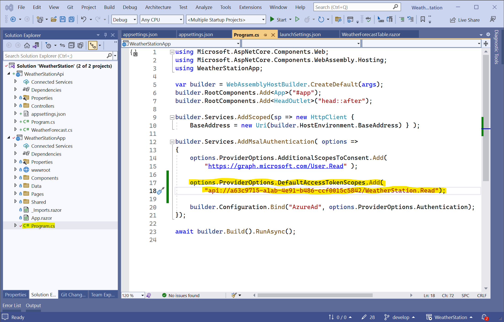

## Autenticação através da biblioteca MSAL
O objetivo deste tutorial é ilustrar a utilização da biblioteca **MSAL** (Microsoft Authentication Library)para autentificar os utilizadores, evitando a necessidade implementar um mecanismo de autenticação e gestão de utilizadores.

### Prérequisitos

Para a realização deste tutorial é necessário o seguinte:

* Visual Studio 2022
* Uma conta Microsoft com acesso ao portal Azure (https://portal.azure.com)

### Autenticação de uma aplicação Cliente usando o Blazor 

O Blazor pode ser utilizado para criar aplicações servidor (server side) ou aplicações cliente (client side). Neste tutorial, vamos começar por criar uma aplicação cliente.

#### Utilizando o CLI

1. Crie uma diretoria para a solução

   ```powershell
   mkdir WeatherStation
   cd .\WeatherStation
   ```

2. Crie uma solução em branco na diretoria 

   ```powershell
   dotnet new sln --name WeatherStation
   ```

3. Crie uma aplicação Blazor WebAssembly

   ```powershell
   dotnet new blazorwasm -n WeatherStationApp -au SingleOrg
   ```

4. Adicione o projeto à solução
   ```powershell
   dotnet sln .\WeatherStation.sln add .\WeatherStationApp\WeatherStationApp.csproj
   ```

#### Utilizando o Visual Studio 2022

Brevemente...

### Registar a aplicação no portal Azure

Para aceder ao portal da Azure (https://portal.azure.com) é necessário ter uma conta individual da Microsoft. 

1. Obter o URL da aplicação web (no presente caso ``https://localhost:7016`` )

   

2. Aceder ao portal da Azure (https://portal.azure.com)

3. Selecionar o serviço "App registrations"

   

4. Criar um novo registo

   

5. Preencher o registo com a seguinte informação (não esquecer de colocar ``/authentication/login-callback`` após o URL da aplicação)

   

6. Recolher os valores de **ClientId** (``eef826f7-58ce-4817-806d-55462a7a63f3``) e do **TenantId** (`f8cdef31-a31e-4b4a-93e4-5f571e91255a`). Navegar para a opção  **Integration assistant**.

   

7. Selecionar as opções **Single-page app** e **Web API** (posteriormente será utilizado este tipo de integração)

   

8. Selecionar **Evaluate my app registration**

   

9. Na página do **Integration Assistant**, na opção **Provide links to your app's terms of service and privacy statement** selecionar **Go to page**

   

10. Configurar com informação análoga à apresentada na seguinte figura e fazer **Save**

    

    ### Configurar a aplicação com os  valores de registo

    1. Editar o ficheiro ``appsettings.json`` e colocar os valores de ``"ClientId"`` e ajustar o valor de ``"Authority"``. O valor de ``"Authority"`` deverá ser uma das seguintes:

       * Para contas "Personal Microsoft Accounts"

       ```c#
       "Authority": "https://login.microsoftonline.com/consumers"
       ```
    
       * Para contas de uma organização 
    
       ```c#
       "Authority": "https://login.microsoftonline.com/<tenant-id>"
       ```

       * Para contas organizacionais e pessoais
    
       ```c#
       "Authority": "https://login.microsoftonline.com/common"
       ```
    
       Escolhemos a terceira opção:
    
       
    
    2. No ficheiro ``Program.cs`` adicionar a seguinte configuração para permitir o acesso aos dados de perfil do utilizador ("https://graph.microsoft.com/User.Read")
    
       ```c#
       using Microsoft.AspNetCore.Components.Web;
       using Microsoft.AspNetCore.Components.WebAssembly.Hosting;
       using WeatherStationApp;
       
       var builder = WebAssemblyHostBuilder.CreateDefault(args);
       builder.RootComponents.Add<App>("#app");
       builder.RootComponents.Add<HeadOutlet>("head::after");
       
       builder.Services.AddScoped(sp => new HttpClient { 
           BaseAddress = new Uri(builder.HostEnvironment.BaseAddress) } );
       
       builder.Services.AddMsalAuthentication( options =>
       {
           options.ProviderOptions.AdditionalScopesToConsent.Add(
               "https://graph.microsoft.com/User.Read" );
       
           builder.Configuration.Bind("AzureAd", options.ProviderOptions.Authentication);
       });
       
       await builder.Build().RunAsync();
       ```
    
    3. Realizar alguma "reengenharia" do código presente na página ``FetchData.razor``
    
       a. Crie uma diretoria **Data** no projeto e mova o objeto **WeatherForecast** para essa diretoria.
    
          
    
       
    
       b. Crie uma pasta **Components** e crie uma componente Blazor designada por ``WeatherForecastTable.razor``
    
          
    
       c. Edite a página ``FetchData.razor``  de forma a proteger a view
    
          
    
    4. Execute e teste.

### Criação de uma API (Application Programming Interface) segura

#### Criação de um projeto do tipo ASP.NET Core WebA API

1. Crie o projeto

   ```c#
   dotnet new webapi -n WeatherStationApi -au SingleOrg
   ```

2. Adicione à solução

   ```
   dotnet sln .\WeatherStation.sln add .\WeatherStationApi\WeatherStationApi.csproj
   ```

3. Atualize o pacote ``Microsoft.Identity.Web``

   ```
   dotnet add WeatherStationApi package Microsoft.Identity.Web
   ```

4. Atualize o pacote

   ```
   dotnet add WeatherStationApi package Swashbuckle.AspNetCore
   ```

5. Verifique as versões dos pacotes

   ``` 
    dotnet list package
   ```

   ```c#
   Project 'WeatherStationApp' has the following package references
      [net7.0]:
      Top-level Package                                            Requested   Resolved
      > Microsoft.AspNetCore.Components.WebAssembly                7.0.5       7.0.5
      > Microsoft.AspNetCore.Components.WebAssembly.DevServer      7.0.5       7.0.5
      > Microsoft.Authentication.WebAssembly.Msal                  *           7.0.5
   
   Project 'WeatherStationApi' has the following package references
      [net7.0]:
      Top-level Package                                        Requested   Resolved
      > Microsoft.AspNetCore.Authentication.JwtBearer          7.0.5       7.0.5
      > Microsoft.AspNetCore.Authentication.OpenIdConnect      7.0.5       7.0.5
      > Microsoft.AspNetCore.OpenApi                           7.0.5       7.0.5
      > Microsoft.Identity.Web                                 2.9.0       2.9.0
      > Swashbuckle.AspNetCore                                 6.4.0       6.4.0
   
   ```

#### Complementar as definições no portal Azure (App registrations)

1. Aceder à operação **Integration assistant **

   

2. Configurar **Configure a unique Application ID URI.**

   

3. Definir os valores de **Application ID**

   

4. Adicionar uma aplicação cliente (vamos utilizar o id da própria aplicação)

   

   #### Atualizar o projeto

   1. Alterar as configurações em app

      

   2. Alterar o ficheiro ``Program.cs`` de forma a permitir o acesso de qualquer origem (Cors)

      

   3. Adicionar o "scope" de acesso na aplicação ``WeatherStationApp``

      

   4. Injetar os objetos ``TokenProvider`` e ``AuthenticationStateProvider``
   
      
   
   5. Requisitar e enviar o token de authenticação
   
      
   
   7. Executar e testar.
